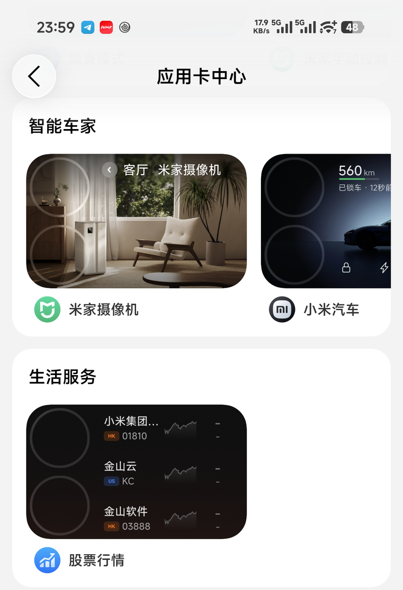

# 小米背屏「应用卡中心」预置卡补全

[](https://github.com/zilewang7/xiaomi-rearscreen-appcard-preset/releases/latest)

给小米 17 Pro / 17 Pro Max 的背屏「**应用卡中心**」补上 ROM 缺失的预置卡片：

| 分类 | 卡片 |
|---|---|
| 天气日历 | **精选台历**、**临近日程** |
| 实用工具 | **隐身模式** |
| 智能车家 | **米家摄像机**、**小米汽车** |
| 生活服务 | **股票行情** |

> 装完后和 18 Pro 系列演示机上的效果一致。



---

## ⚠️ 先确认：你装 REAREye 了吗？

如果你装了 [REAREye](https://github.com/killerprojecte/REAREye)（`hk.uwu.reareye`），
**本模块会失效，别白折腾**。

原因：REAREye 的 `PresetPackFilesHook` 会 hook 背屏中心
（`com.miui.personalassistant`）对系统预置路径的**所有文件访问**
（`File.exists` / `FileInputStream` / `Os.open` / `ZipFile`），
把它重定向到 REAREye 自己提交的 RPP 快照。只要你在 REAREye 里装过预设包，
应用就再也不会去读 `/system/media/rearscreen/...` —— 本模块挂上去的文件一次都不会被读到。

表现出来就是：**状态面板 15 项全绿，卡片就是不出现。**

两者是二选一：

| 你的情况 | 该用什么 |
|---|---|
| 装了 REAREye，想用它的其它增强功能 | **用 REAREye 自带的「预设包」**，卸载本模块 |
| 没装 REAREye，只想要这几张卡片 | 用本模块 |
| 装了 REAREye 但没启用预设包 | 本模块可用；一旦启用预设包就会失效 |

状态面板的「**冲突检测**」一栏会自动帮你判断属于哪种情况。

如果它报红，卡片上会**直接给一个「清除 REAREye 预设包」按钮**：
连点两次确认（第一次只是上膛，8 秒内不点第二次会自动取消），
它会删掉 REAREye 提交的快照缓存、重启应用卡中心，重启手机后本模块即生效。
不用自己去 REAREye 的菜单里翻。

> 只删缓存，不动 REAREye 的应用本体和其它设置。REAREye 想用随时可以重新下载预设包
> （不过它的资源包是个 62 MB 的大文件，下载/校验中断时会留下半成品，
> 表现是它自己的卡片也不显示）。

---

## 安装

### 1. 下载

到 [**Releases**](https://github.com/zilewang7/xiaomi-rearscreen-appcard-preset/releases/latest)
下载 `xiaomi-rearscreen-appcard-preset-v*.zip`。

### 2. 刷入

在 **APatch / Magisk / KernelSU** 的模块管理里选择「从本地安装」，选中刚下载的 zip。

安装过程中模块会联网拉取卡片资源（约 7 MB，31 个文件），并逐个校验 SHA-256。
控制台会打印进度。

> 装的时候没网也没关系 —— 模块会在开机联网后自动补齐。

> 安装最多花 100 秒联网。**超时也不会卡住安装** —— 模块照样装好，
> 剩下的资源在开机联网后自动补齐。

### 3. 重启

重启后打开 **设置 → 应用卡中心**，即可看到上表里的卡片。

---

## 出问题了？先看状态面板

模块卡片里点开就是状态面板，自己就能查：

| | |
|---|---|
| **APatch / KernelSU** | 直接点模块卡片 → 打开面板 |
| **Magisk** | 点模块卡片上的 **「操作」** 按钮，会跑一遍诊断并把结果打出来 |

面板把每一环都列出来，绿 ✓ 正常、黄 ! 注意、红 ✕ 异常，异常项下面直接写**该怎么办**：

```
运行环境    设备 / 系统 / Root 方案 / 模块版本
资源        31 个文件是不是都下全了（逐个 SHA-256 校验）
注入状态    预设挂到系统没有、SELinux 上下文对不对、路径通不通
预设内容    几个分类、几张卡片
卡片就绪度  ← 重点：每张卡片依赖的 App 装了没、版本够不够
应用卡中心  版本、进程状态
```

**「装了模块但卡片不出现」，九成是「卡片就绪度」里有红项。**
应用卡中心会自己过滤掉「依赖 App 没装或版本不够」的卡片 —— 预设挂对了也没用。
比如 `小米汽车` 要求装了小米汽车 App 且版本 ≥ 25102214。

面板底部一排按钮直接用：

- **重新检测** —— 重跑一遍
- **立即补齐资源** —— 后台把没下完的资源补上
- **重启卡中心** —— 让应用重新读取预设
- **导出日志** —— 生成 `/sdcard/Download/appcard-log-<时间>.txt`，发给开发者即可
- **复制诊断** —— 把诊断文本复制出来（剪贴板不可用时存到 `Download/appcard-diagnose.txt`）

---

## 前提

- 机型：小米 **17 Pro / 17 Pro Max**（其它带背屏的机型可自行尝试）
- 已 root：APatch / Magisk / KernelSU 任一
- 每张卡片都要求对应的应用在场（应用卡中心会自己过滤掉不满足的卡片）。
  具体版本要求不必背 —— **状态面板的「卡片就绪度」会逐张告诉你缺哪个**。
  **小米汽车卡还需要在小米汽车 App 里登录并绑定车辆。**

---

## 卸载

在模块管理器里删除 `RearScreen AppCard Preset` 后重启即可，系统文件未被改动。

---

## 常见问题

**卡片不出现？**
先开状态面板（见上文），看「**冲突检测**」和「**卡片就绪度**」两栏。
- 「冲突检测」是红的 → 你装了 REAREye 且它接管了预置路径，**本模块对它无效**，见页首说明。
  卡片里有「清除 REAREye 预设包」按钮，连点两次即可修复。
- 「资源权限」是红的 → 文件下载了但**权限不对，应用读不到**（早前版本的 bug，见下）。
  卡片里有「修好资源权限」按钮，连点两次即可修好，不用重启。
- 「资源完整性」有黄的 → 资源还没下完。点「立即补齐资源」，或重启一次让它自己补。
- 「卡片就绪度」有红的 → 装的 App 不对或版本不够。对照这张表：

| 你要的卡片 | 需要装的 App | 最低版本 |
|---|---|---|
| 精选台历 / 临近日程 | 日历 | 180000040 |
| 小米汽车 | 小米汽车 | 25102214 |
| 米家摄像机 | 米家 | 11060500 |
| 股票行情 | 智能助理（系统自带） | — |
| 隐身模式 | 安全中心（系统自带） | — |

全部绿了还是没有卡片，再试：
1. 确认重启过设备（挂载发生在开机阶段）
2. 点面板上的「重启卡中心」，或手动打开一次应用卡中心
3. 导出日志贴到 issue 里

**安装卡住了？**
不会卡死。模块对每个请求都有超时，整体最多 100 秒。
如果停在某一行很久，说明当前镜像慢 —— 等它走完或直接点取消，
装完后重启，开机会自动把剩下的补上。
想快点可以连上代理（模块**直连 GitHub 优先**，有代理就走代理）。

**下载失败？**
模块直连 GitHub 优先，失败会依次尝试 `mirrors.txt` 里的加速镜像。
镜像列表**可远程更新** —— 维护者改一次 `mirrors.txt`，所有已装模块下次联网自动生效，无需重新发版。
你也可以在当地网络下自行编辑 `/data/adb/modules/rearscreen_appcard_preset/mirrors.txt`。

**官方更新后还需要它吗？**
小米已表示 17 Pro 系列背屏 AI 功能将于 **12 月底**更新。官方推送后建议卸载本模块，用官方方案。
面板里的「预设内容」能看出 ROM 是否已自带这套卡片。

**怎么反馈问题？**
状态面板点「导出日志」，把 `内部存储/Download/appcard-log-<时间>.txt` 发出来。
这个文件不含账号信息，可以直接贴到论坛或 issue。

---

## 原理（简述）

「应用卡中心」的清单来自两处：

1. **云端** `store.assistant.miui.com/component/store/backPage`
2. **本地预置** `/system/media/rearscreen/appcard/default/rearScreen.json`

18 系 ROM 自带第 2 项，17 系没有 —— 智能助理解析时报
`parsePresetJson: file not found`，于是所有预置卡都不显示。
（与机型代号、账号灰度、请求参数无关，已实测排除。）

本模块把预置卡注入该路径。由于 APatch 把「模块文件挂载」委托给常未安装的
metamodule，模块改用**生命周期脚本自行 bind mount**，兼容性最好。

细节：

- [根因分析](docs/root-cause.md)
- [为什么用脚本挂载 / APatch 行为考证](docs/apatch-notes.md)
- [状态面板是怎么做的](docs/status-page.md)

---

## 说明

- 本仓库**不包含任何小米资源文件**。卡片资源在安装时从上游
  [NekoStash/REAREye-Preset-Resources](https://github.com/NekoStash/REAREye-Preset-Resources)
  拉取并逐个校验 SHA-256，版权归小米所有。
- 非官方项目，与小米公司无关；修改系统行为有风险，请自行承担。
- 代码以 [MIT](LICENSE) 授权（不含卡片资源）。

## 致谢

- [NekoStash/REAREye-Preset-Resources](https://github.com/NekoStash/REAREye-Preset-Resources) —— 预置卡资源
- [killerprojecte/REAREye](https://github.com/killerprojecte/REAREye) —— 背屏增强模块
- [bmax121/APatch](https://github.com/bmax121/APatch) —— 挂载机制文档
